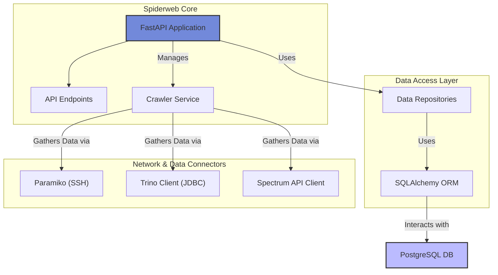
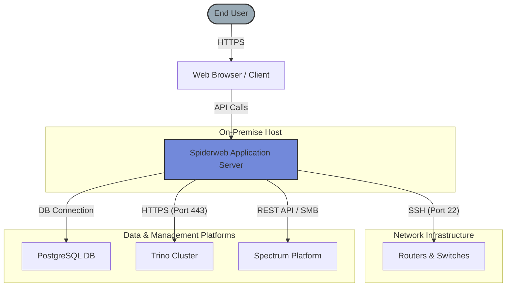

# Spiderweb

[](https://opensource.org/licenses/MIT)

Welcome to Spiderweb, a powerful and comprehensive network monitoring and management solution. Spiderweb is designed to provide real-time insights into your network's health, performance, and topology by actively crawling network devices and presenting the data through a clean, modern API.


## Table of Contents

- [Features](#features)
- [Architecture](#architecture)
- [Infrastructure Diagram](#infrastructure-diagram)
- [Technologies Used](#technologies-used)
- [Installation and Setup](#installation-and-setup)
- [API Endpoints](#api-endpoints)
- [Usage](#usage)
- [Contributing](#contributing)

## Features

*   **Real-time Network Monitoring:** Spiderweb continuously crawls your network devices to collect up-to-date information on link status, traffic, and errors.
*   **Topology Visualization:** Gain a clear understanding of your network's architecture with our intuitive and interactive topology maps.
*   **Alerting and Notification:** Receive timely alerts on critical network events, enabling you to proactively address issues before they impact your services.
*   **User and Role Management:** Secure your network management with our robust user and role management system, ensuring that only authorized personnel have access to sensitive information.
*   **Comprehensive API:** Spiderweb's comprehensive API allows for seamless integration with your existing systems and workflows.
*   **Favorite Links:** Save and easily access your most important links for quick and efficient network management.
*   **Detailed Link Information:** Get detailed information on each link in your network, including physical and protocol status, MPLS LDP, OSPF, and more.

## Architecture

Spiderweb is built on a modern and scalable architecture. The application core, powered by FastAPI, serves both the API endpoints and manages the background crawler service. The crawler uses a set of connectors to gather data, which is then processed and stored by the data access layer.



## Infrastructure Diagram

The following diagram illustrates Spiderweb's deployment infrastructure and its interaction with the network and external services. The central application server connects to network devices, data sources like Trino, and management platforms to aggregate data.



## Technologies Used

*   **Backend:** Python
*   **API Framework:** FastAPI
*   **Database ORM:** SQLAlchemy
*   **Database Migrations:** Alembic
*   **Database:** PostgreSQL (with `psycopg2` driver)
*   **Network Automation:** Paramiko for SSH connectivity
*   **Data Federation:** Trino for querying large-scale data sources
*   **Authentication:** JWT (JSON Web Tokens) for secure API endpoints

## Installation and Setup

1.  **Clone the repository:**
    ```sh
    git clone https://github.com/your-username/spiderweb.git
    cd spiderweb
    ```
2.  **Install the dependencies:**
    ```sh
    pip install -r requirements.txt
    ```
3.  **Set up the database:**
    *   Ensure PostgreSQL is installed and running.
    *   Create a new database named `spiderweb`.
    *   Configure your database credentials in the `alembic.ini` file under the `sqlalchemy.url` setting.
    *   Run the database migrations to create the necessary tables:
        ```sh
        alembic upgrade head
        ```
4.  **Run the application:**
    ```sh
    uvicorn main:app --host 0.0.0.0 --port 8000
    ```

## API Endpoints

Spiderweb's API is documented using OpenAPI (Swagger UI), which is automatically available at `/docs` when the application is running.

-   **Base URL:** `http://localhost:8000/`
-   **Interactive Docs:** `http://localhost:8000/docs`
-   **Alternative Docs:** `http://localhost:8000/redoc`

**Key Endpoints:**
*   `/login`: Authenticate a user and receive an access token.
*   `/users/`: Get a list of all users.
*   `/networks/`: Get a list of all networks.
*   `/links`: Get a list of all links with powerful filtering options.
*   `/alerts`: Poll for real-time network alerts.

## Usage

Once Spiderweb is running, you can interact with the API using any HTTP client or by visiting the interactive documentation in your browser. The background crawler will automatically start fetching data from the network devices as configured.
